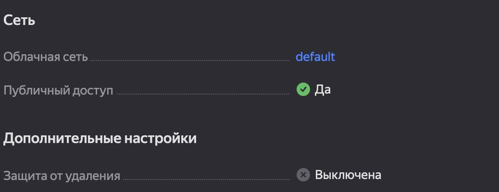
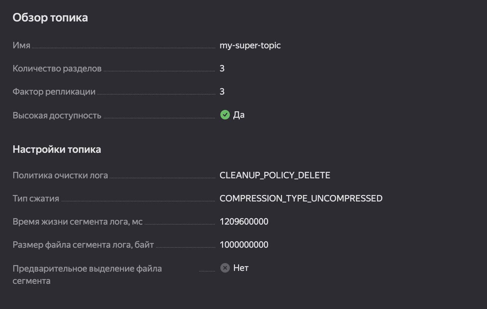
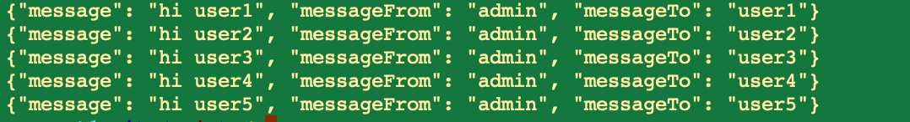

# Развёртывание и настройка Kafka-кластера в Yandex Cloud

### Шаг 1. Развертывание Kafka
Развернул кластер Kafka вместе с Schema Registry и публичным доступом.

### Шаг 2. Настройка топика
Создал топик my_super_topic с политикой очистки логов

### Шаг 3. Настройка Schema Registry
Сервис схем данных был развернут автоматически. 
Находясь в ВМ, зарегистрировал схему с помощью команды 

    jq \
    -n --slurpfile data message-value.json \
    '{
       "schemaType": "AVRO",
       "schema": "\($data)"
        }' \
    | curl \
    --request POST \
    --url 'https://rc1b-aq1r1qodp5g4i29m.mdb.yandexcloud.net:443/subjects/my-super-topic-value/versions' \
    --user kafka-test-user:kafka-test-pass \
    --header 'Content-Type: application/vnd.schemaregistry.v1+json' \
    --cacert /usr/local/share/ca-certificates/Yandex/YandexInternalRootCA.crt \
    --data "@-"

### Шаг 4. Подключение приложений
Я создал два приложения на Java для отправки и для получения сообщений. 
Запустил их из ВМ. Отправилил и получил сообщения

