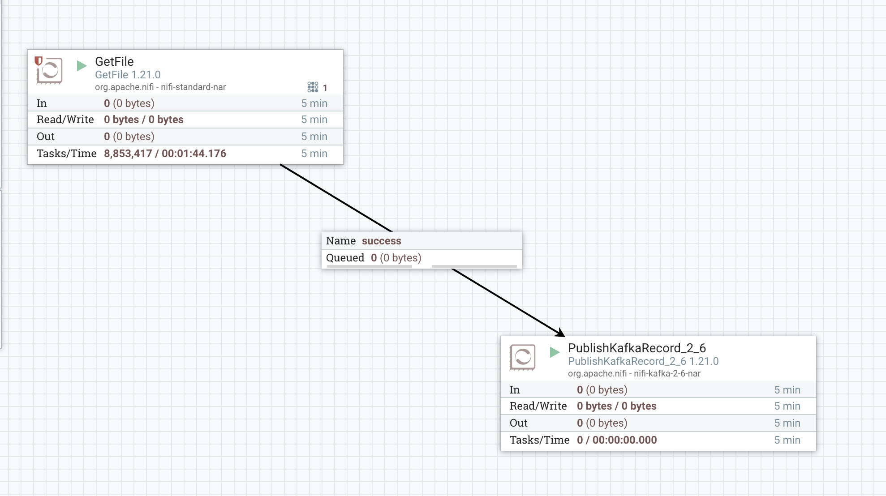
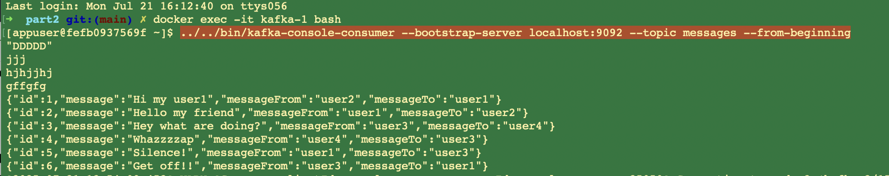
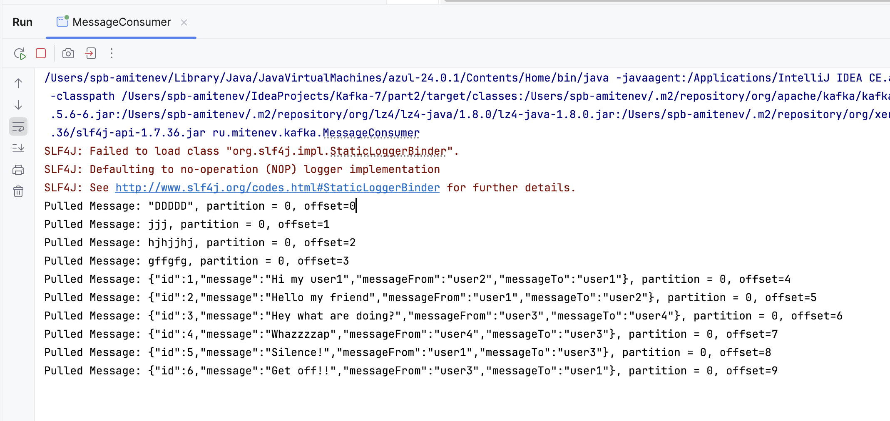

### Интеграция  с NiFi

Я подготовил kafka-кластер и nifi-сервис в виде docker-compose файла

Запустил инфраструктуру 

    docker-compose up -d

Создал топик для сообщений с помощью команды

    docker exec -it kafka-1 ../../usr/bin/kafka-topics --create --topic messages --bootstrap-server localhost:9092 --partitions 3 --replication-factor 2

Затем в консоли Nifi создал DataFlow из двух процессоров
Читаю из CSV-файла и отправляю сообщения в очередь

Запустив консольный коньюмер или консюмер на Java можно получить сообщения из топика

../../bin/kafka-console-consumer --bootstrap-server localhost:9092 --topic messages --from-beginning

